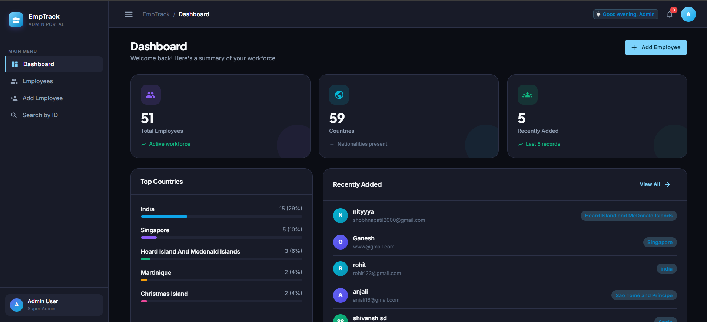
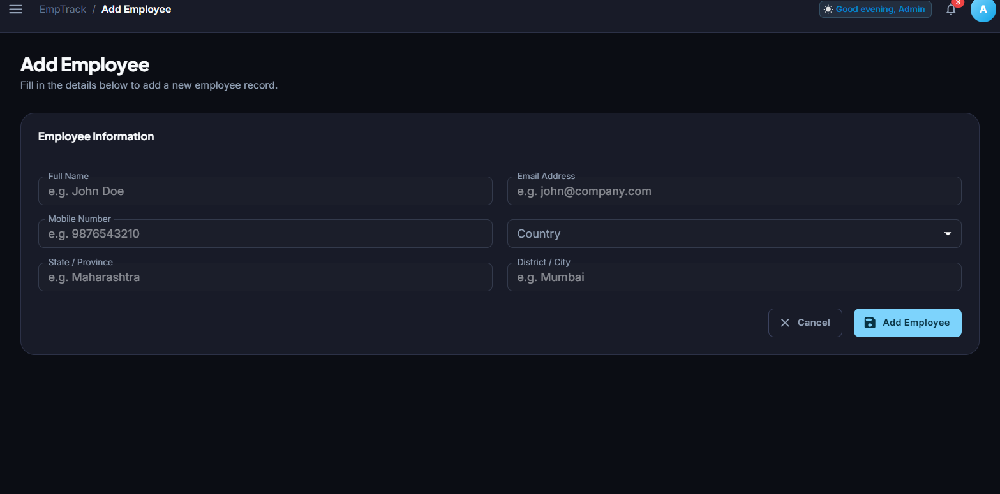
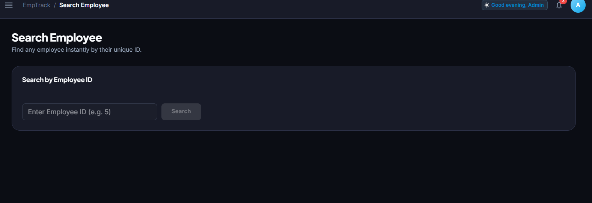

# EmpTrack — Employee Management System

[](https://react.dev/)
[](https://vitejs.dev/)
[](https://redux-toolkit.js.org/)
[](https://mui.com/)
[](https://vitest.dev/)
[](./LICENSE)

> A modern, responsive **Employee Management System** built with React, Redux Toolkit, Material UI, and REST APIs. Designed as a professional SaaS-grade admin dashboard with a premium dark mode UI.

---

## 📸 Screenshots

### Dashboard

*Stat cards, quick actions panel, and recently added employees list*

### Add Employee

*Validated 2-column form with React Hook Form + Yup*

### Search Employee

*Fetch employee by ID with found/not-found/error states*

> **Note:** Place actual screenshots in the `public/screenshots/` folder. The app generates its own avatar colors dynamically — no image uploads required.

---

## ✨ Features

- 🗂️ **CRUD Operations** — Create, Read, Update, Delete employees
- 🔍 **Employee Search by ID** — Instant lookup with full not-found/error handling
- 🔎 **Client-side Filtering** — Filter employees by name, email, country, or ID
- 🌍 **Country API Integration** — Countries dynamically fetched from REST API
- ✅ **Form Validation** — React Hook Form + Yup with field-level error messages
- 🧩 **Redux Toolkit State Management** — Slices, async thunks, selectors
- 📊 **Responsive Dashboard** — Stat cards, Top Countries widget, recent employees
- 💀 **Skeleton Loaders** — Table and card skeleton loaders during data fetching
- ⚠️ **Error States** — Descriptive error messages with retry capability
- 🫙 **Empty States** — Helpful prompts when no data exists
- 📄 **Pagination** — Client-side pagination (15 items per page) for optimal performance
- 🗑️ **Delete Confirmation** — Never immediately delete, always confirm first
- 🍞 **Toast Notifications** — Success/error feedback for all CRUD operations
- 🧾 **Employee Details View** — Dedicated detail page with profile card
- 📱 **Responsive UI** — Sidebar for desktop, drawer for mobile; cards for mobile table
- ♿ **Accessibility** — ARIA labels, focus states, semantic HTML, keyboard navigation
- 🌙 **Premium Dark Theme** — Polished, high-contrast UI tailored for modern SaaS apps
- 🧪 **Unit Testing** — 33 tests across services, Redux slices, and components

---

## 🛠️ Tech Stack

| Technology | Purpose |
|---|---|
| **React 19** | Frontend framework |
| **Vite** | Build tool with HMR |
| **Redux Toolkit** | Global state management |
| **React Redux** | React bindings for Redux |
| **Axios** | HTTP client (service layer) |
| **Material UI (MUI)** | UI component library |
| **React Hook Form** | Performant form handling |
| **Yup** | Schema-based validation |
| **React Router v7** | Client-side routing |
| **Notistack** | Toast/Snackbar notifications |
| **Vitest** | Unit testing framework |
| **React Testing Library** | Component testing utilities |

---

## 🚀 Getting Started

### Prerequisites

- Node.js 18+
- npm 9+

### Installation

```bash
git clone <YOUR_GITHUB_REPOSITORY_URL>
cd employee-management
npm install
```

### Environment Setup

```bash
cp .env.example .env
```

Open `.env` and configure:

```env
VITE_API_BASE_URL=https://669b3f09276e45187d34eb4e.mockapi.io/api/v1
```

### Run Development Server

```bash
npm run dev
```

Open [http://localhost:5173](http://localhost:5173) in your browser.

---

## 🧪 Testing

Run all tests:

```bash
npm run test
```

Run tests in watch mode:

```bash
npm run test:watch
```

Run with coverage report:

```bash
npm run test:coverage
```

### What's Tested

| Test File | Coverage |
|---|---|
| `employeeService.test.js` | All 5 API service methods (mock axios) |
| `employeeSlice.test.js` | Initial state, all CRUD reducers, pending/fulfilled/rejected |
| `ConfirmDialog.test.jsx` | Open/close, confirm, cancel, loading states |
| `EmployeeTable.test.jsx` | Rendering, empty state, delete callback |
| `EmployeeForm.test.jsx` | Field rendering, required/email/mobile validation, edit mode |

---

## 🏗️ Production Build

```bash
npm run build
```

Preview the production build locally:

```bash
npm run preview
```

Production output is generated in the `dist/` directory.

---

## 📁 Project Structure

```
src/
├── app/
│   └── store.js                # Redux store configuration
│
├── components/
│   ├── common/                 # Reusable UI primitives
│   │   ├── LoadingSpinner.jsx
│   │   ├── SkeletonLoader.jsx
│   │   ├── ErrorState.jsx
│   │   ├── EmptyState.jsx
│   │   ├── ConfirmDialog.jsx
│   │   ├── SearchBar.jsx
│   │   └── PageHeader.jsx
│   │
│   ├── dashboard/              # Dashboard-specific components
│   │   ├── StatCard.jsx
│   │   └── RecentEmployees.jsx
│   │
│   ├── employees/              # Employee feature components
│   │   ├── EmployeeTable.jsx
│   │   ├── EmployeeCard.jsx    # Mobile card view
│   │   ├── EmployeeForm.jsx    # Add/Edit form (RHF + Yup)
│   │   ├── EmployeeDetails.jsx # Detail display
│   │   └── EmployeeActions.jsx # View/Edit/Delete buttons
│   │
│   └── layout/                 # App shell components
│       ├── Navbar.jsx
│       ├── Sidebar.jsx
│       └── AdminLayout.jsx
│
├── features/
│   ├── employees/
│   │   ├── employeeSlice.js    # Redux slice
│   │   ├── employeeThunks.js   # Async thunks
│   │   └── employeeSelectors.js
│   │
│   └── countries/
│       ├── countrySlice.js
│       ├── countryThunks.js
│       └── countrySelectors.js
│
├── pages/                      # Smart (container) components
│   ├── Dashboard.jsx
│   ├── Employees.jsx
│   ├── AddEmployee.jsx
│   ├── EditEmployee.jsx
│   ├── EmployeeDetailsPage.jsx
│   ├── SearchEmployee.jsx
│   └── NotFound.jsx
│
├── routes/
│   └── AppRoutes.jsx           # Lazy-loaded route definitions
│
├── services/                   # Axios service layer
│   ├── api.js
│   ├── employeeService.js
│   └── countryService.js
│
├── test/                       # Unit tests
│   ├── setup.js
│   ├── employeeService.test.js
│   ├── employeeSlice.test.js
│   ├── ConfirmDialog.test.jsx
│   ├── EmployeeTable.test.jsx
│   └── EmployeeForm.test.jsx
│
└── utils/
    └── theme.js                # MUI theme with custom design tokens
```

---

## 🌐 API Endpoints

Base URL: `https://669b3f09276e45187d34eb4e.mockapi.io/api/v1`

| Method | Endpoint | Description |
|---|---|---|
| `GET` | `/country` | Get all countries |
| `GET` | `/employee` | Get all employees |
| `GET` | `/employee/:id` | Get employee by ID |
| `POST` | `/employee` | Create new employee |
| `PUT` | `/employee/:id` | Update employee |
| `DELETE` | `/employee/:id` | Delete employee |

---

## 🏛️ Architecture

### Smart / Dumb Component Pattern

**Smart Components** (pages): handle Redux dispatch, routing, business logic
**Dumb Components** (components/): only receive props and fire callbacks — no Redux access

### Redux State Shape

```js
{
  employees: {
    employees: [],
    selectedEmployee: null,
    loading: false,
    error: null,
    searchLoading: false,
    operationLoading: false
  },
  countries: {
    countries: [],
    loading: false,
    error: null
  }
}
```

---

## 🚀 GitHub Push Commands

```bash
git init
git add .
git commit -m "feat: initial employee management application"
git branch -M main
git remote add origin https://github.com/YOUR_USERNAME/YOUR_REPOSITORY.git
git push -u origin main
```

**Suggested git topics:** `react` `vite` `redux-toolkit` `material-ui` `employee-management` `crud` `rest-api` `frontend` `javascript` `responsive-design`

---

## 🔮 Future Improvements

- 🔐 Authentication & JWT-based login
- 🎭 Role-based access control (Admin / HR / Viewer)
- 🔎 Advanced filtering (date range, department)
- 📸 Employee profile photo upload
- 📊 Analytics charts (department breakdown, growth)
- 📥 Export employees to CSV / Excel
- 🔔 Email notification on employee events
- 🚀 Backend integration with MongoDB / PostgreSQL
- ☁️ Deployment to Vercel / Netlify / AWS

---

## 🎨 UI/UX Reference

UI/UX principles were informed by the [UI/UX Pro Max skill repository](https://github.com/nextlevelbuilder/ui-ux-pro-max-skill):

> This project is an **original implementation**. The referenced repository provided design intelligence guidance (visual hierarchy, color systems, typography, interaction patterns, spacing principles), not template code.

---

## 📄 License

MIT License — free for personal and commercial use.
